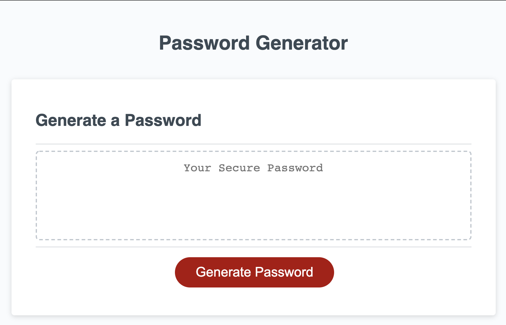
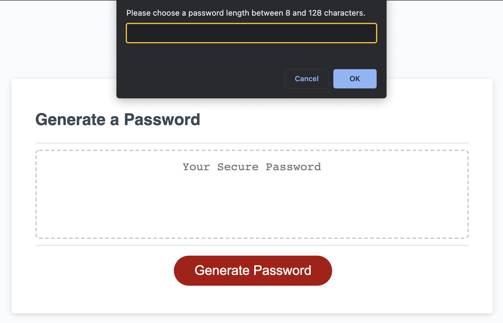
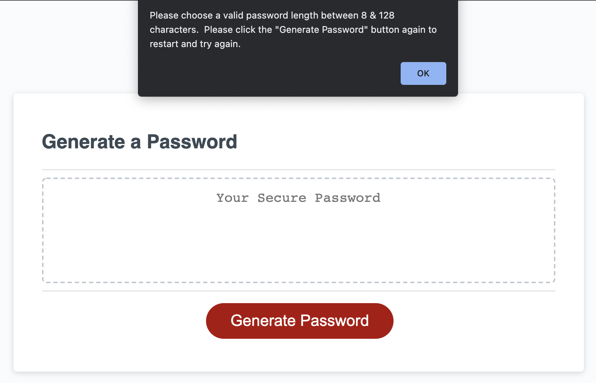
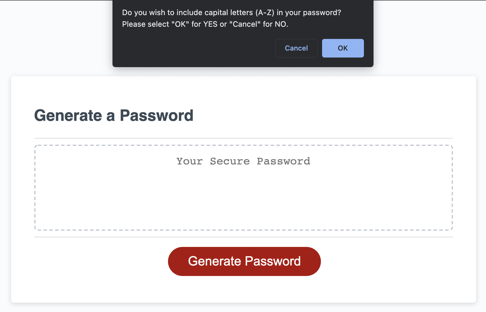
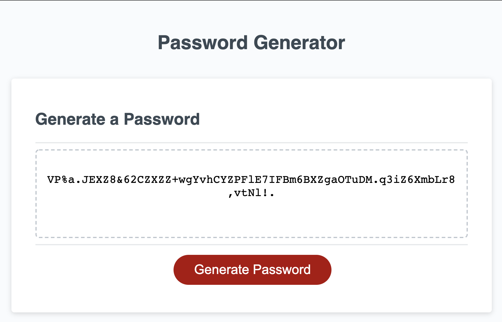

# Password Generator

## Purpose
The purpose of this project is to create an application that randomly generates a password based on criteria selected by the user.  

## Application Details

Site home page:

Once the 'generate password' button is clicked, user is prompted to enter a password length:

If user inputs an invalid length value, they are prompted to try again:

After inputing a valid length value, the user is asked to confirm if they wish to include capital letters in their password:

User is prompted to confirm if they wish to inlcude lowercase letters:

User is prompted to confirm if they wish to include numbers:

User is prompted to confirm if they wish to include special characters:

User is presented their randomly generated password based on their previously selected criteria:

## Deployed Application 
This application is deployed through GitHub Pages
The application can be accessed by this link: https://kalecodes.github.io/passwordinator/

## Credits 
Starter code provided by coding boot camp.
GitHub repository containing starter code: https://github.com/coding-boot-camp/friendly-parakeet

